# 01 N8n 소개 및 설치

## 01.01 N8n 소개 및 설치

### N8N 이란

- n8n (pronounced n-eight-n) 은 앱들을 다른앱들과 API를 통해서 연결하도록 도와준다.
- 그리고 코드 없이 해당 작업을 조작하도록 한다.
  - 커스텀화가능:
    - 높은 유연성을 가진 워크플로우와 커스텀 노드들을 추가적으로 빌드할 수 있다.
  - 편리성:
    - npm이나 Docker를 이용하여 n8n을 구성할 수 있다. 
    - 만약에 인프라를 이용하고자 하는 경우 선택적으로 클라우드 호스팅을 이용할 수 있다.
  - 사설 포커싱:
    - 사설 이용 혹은 보안을 위해서 self-host n8n 구성 가능

### 주요 기능

#### 시각적인 워크플로우 빌더

- 드래그 앤 드롭 방식의 직관적인 인터페이스를 제공
- 복잡한 워크플로우를 노드로 연결하여 쉽게 설계 가능

#### 광범위한 통합

- 400개 이상의 애플리케이션 및 서비스와 연동이 가능
- Gmail, Notion, Slack, Google Sheet등 인기있는 도구들과 쉽게 통합가능

#### AI 기능 통합

- LangChain 노드를 통해 AI 기능을 워크 플로우에 통합 가능
- 챗봇 생성, 문서 요약, 정보 추출 등의 AI 작업을 자동화 가능

#### 커스터마이징 및 확장성

- 오픈 소스로 제공되어 필요에 따라 수정/확장이 가능 
- 커스텀 노드 개발을 통해 특정 요구사항에 맞는 기능을 추가가능

#### 데이터 처리 및 변환

- 다양한 데이터 조작 및 변환 노드 제공
- JSON 파싱, 정규표헌식 활용 등 고급 데이터 변환 기능 지원

#### 오류처리 및 디버깅 

- 워크플로우 실행 중 발생하는 오류를 처리하고 디버깅할 수 있는 기능을 제공

#### 호스팅 옵션 

- 셀프 호스팅과 클라우드 호스팅 옵션을 모두 제공 
- Docker, Kubernetes 등을 통해 쉽게 배포하고 관리할 수 있음 

## 설치 방법 및 라이선스

### 플랫폼

- n8n 은 어떤 방식을 사용하느냐에 따라 다른 방법으로 이용할 수 있다. 
- [n8n Cloud](https://docs.n8n.io/manage-cloud/overview/): 호스트된 솔루션이다. 인스톨이 필요없다. 
  - n8n Cloud 는 호스트된 솔루션이다. 
  - n8n 인스턴스를 관리하거나 설정할 필요가 없다. 
  - 지속적인 모니터링 가능
  - OAuth 로 권한 관리
  - 원클릭 업그레이드 지원
- [Self-host](https://docs.n8n.io/hosting/): 프로덕션, 커스터마이즈 케이스에서 사용된다. 
  - npm으로 설치: https://docs.n8n.io/hosting/installation/npm/
  - Docker으로 설치: https://docs.n8n.io/hosting/installation/docker/
  - 인기 있는 플랫폼을 위한 서버 설정 가이드: https://docs.n8n.io/hosting/installation/server-setups/
- [Embed](https://docs.n8n.io/embed/): 여러분의 자체 제품 내부에 내장된 도구를 이용할 수 도 있다. [Embed website](https://n8n.io/embed/?_gl=1*y7tjj4*_gcl_au*MTU2NDQ1NTQwNS4xNzMzMTE4Mjcw*_ga*MTEzMDE3NjI3Ni4xNzMzMTE4Mjcw*_ga_0SC4FF2FH9*MTczNjM4MTk0Mi4yLjEuMTczNjM4NDAxNy4yNi4wLjA.)에서 가격과 서포트를 확인하자. 

## Quick Start

- quickstart 는 n8n 테스트를 빠르게 수행할 수 있도록 한다. 
- 이는 UI를 이용하도록 하고, 2개의 핵심 기능에 대해서 소개한다. 
  - 워크플로우 템플릿
  - 표현식
- 이 가이드를 통해서 다음을 알 수 있음
  - 워크플로 템플릿 라이브러리에서 워크플로를 로드할 수 있다. 
  - 노드를 추가하고, 표현식을 설정할 수 있다. 
  - 첫번째 워크플로우 실행

### Step.1 n8n에 Sign up 하기

- n8n을 위해서 Cloud 서비스, npm 모듈, Docker 이미지 등을 이용할 수 있다. 
- 여기서는 Cloud를 이용할 것을 추천한다. 새 유저에게는 무료 트라이얼이 있다. 

### Step.2 워크플로 템플릿 열기

- n8n 은 training nodes를 이용하여 퀵스타트 템플릿을 제공한다. 
- 이는 fake 데이터로 작업을하여, 크레덴셜 설정을 하지 않아도 되게 해준다. 
  
  1. [Template | Very quick quickstart](https://n8n.io/workflows/1700-very-quick-quickstart/?_gl=1*jlxzv8*_gcl_au*MTU2NDQ1NTQwNS4xNzMzMTE4Mjcw*_ga*MTEzMDE3NjI3Ni4xNzMzMTE4Mjcw*_ga_0SC4FF2FH9*MTczNjQxNTEwNi40LjEuMTczNjQxNTYzNC41MC4wLjA.) 이동
  2. Use workflow 선택하여, template를 이용할 수 있는 옵션을 선택한다.
  3. Import template to cloud workspace 를 선택하고, 클라우드 인스턴스에 템플릿을 로드한다. 

- 이 워크플로우
  
  1. Customer Datastore 노드로 예제 데이터 조회하기
  2. Edit Fields 노드를 이용하여 원하는 데이터를 추출한다. 그리고 데이터를 변수에 할당하기 (이 예제에서 customer name, ID, description)을 선택할 수 있다.

- n8n 워크플로우에서 노드라고 불리는 개별적인 조각이 존재한다. 
- 노드를 더블클릭하여 설정으로 들어가고, 어떻게 데이터를 처리할지 설정할 수 있다. 

### Step.3 워크플로우 실행하기

- Test Workflow를 선택한다.
- 이는 워크플로우를 실행하며, Customer Datastore node에서 데이터를 로딩한다. 
- 그리고 Edit Fields로 변환한다. 
- 워크플로우에서 데이터가 필요하며, 다음 스탭에서 이 작업을 수행할 수 있다. 

### Step.4 노드 추가하기

- 세번째 노드를 각 고객 메시지와 이들의 설명을 추가한다. 
- Customer Messenger 노드를 이용하여 수신자에게 메시지를 보낸다. 

  1. Add node [+] 를 선택하여 Edit Fields 노드에 연결한다. 
  2. Customer Messenger 를 검색한다. n8n 은 검색에 매치되는 노드 목록을 보여준다. 
  3. Customer Messenger(n8n trainint) 을 선택하여 canvas 에 노드를 추가한다. n8n 은 노드를 자동적으로 오픈한다. 
  4. expression을 이용하여 고객ID 를 매핑하고 메시지를 작성한다. 
     1. customer_id를 INPUT에서 드래그 하고, Customer ID 필드에 노드세팅에서 붙여 넣는다. 
     2. 메시지에 마우스를 올리고, Expression 탭을 선택한다. 그리고 확장 버튼을 열어 전체 표현식을 추가한다. 
     3. 다음내용을 복사해서 붙여넣자. 
     ```
      Hi {{$json.customer_name}},  Your description is {{$json.customer_description}}
     ```
  5. expression 에디터를 닫고, Customer Messenger 노드를 외부 영역을 눌러서 닫고 canvas로 돌아온다. 
  6. Test Workflow를 선택하고, n8n 워크플로우를 실행한다. 

- 다음 워크플로우 내용을 보여준다. 

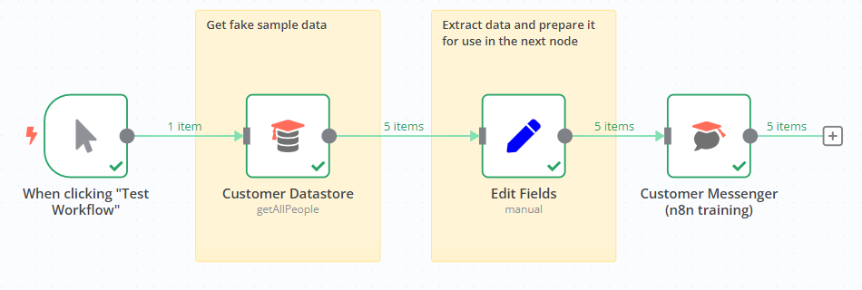

## 약간 긴 퀵스타트 

- 이 가이드는 n8n에서 워크플로를 이용하여 자동화된 태스크를 어떻게 만드는지 보여준다. 
  - 처음에 워크플로를 생성한다. 매주 NASA에서 데이터를 읽어들이고, 데이터를 필터하고, 2개의 리포트를 생성한다. 
  - 핵심 개념과 스킬은 다음과 같다. 
    - 트리거노드들에 워크플로를 시작한다. 
    - 크레덴셜을 설정한다. 
    - 데이터를 조작한다. 
    - n8n 워크플로에서 로직을 표현한다. 
    - 표현식을 이용한다. 

### Step 01. n8n 로그인하기

- n8n은 [Cloud](https://docs.n8n.io/choose-n8n/cloud/) 서비스로, [npm](https://docs.n8n.io/hosting/installation/npm/) 모듈을 이용하거나, [Docker](https://docs.n8n.io/hosting/installation/docker/) 이미지를 이용할 수 있다. 
- Cloud 사용을 권하며, 신규 사용자에게 free trial을 제공한다. 

### Step 02. 신규 워크플로

- 비어있는 워크 플로: 이전 워크플로가 없다면, 처음에는 로그인을 할때 생긴 워크플로를 이용하면 된다. 
- Overview페이지에 Workflow리스트를 볼 수 있다. [+] 을 이용하여 새로운 워크플로우를 생성할 수 있다. 
<br/>
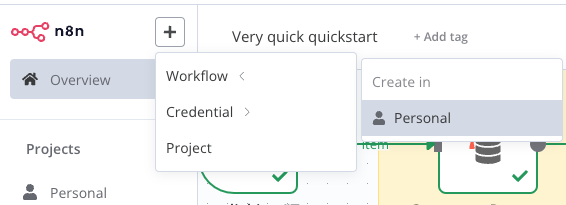
<br/>
- 워크플로가 생성되면 다음과 같이 비어 있는 워크플로가 보인다.
<br/>
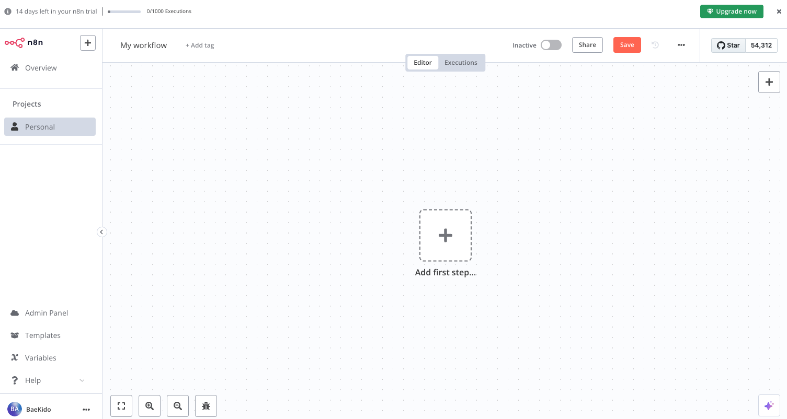
<br/>

### Step 03. 트리거 노드를 추가한다. 

- n8n은 2가지 방법으로 워크플로를 실행할 수 있다. 
  - 수동: 
    - Test Workflow를 선택하거나, CLI에서 수행(npm, Docker설치시)할 수 있다. 
  - 자동:
    - 첫번째 트리거 노드를 이용하여 실행할 수 있다. 
    - 트리거노드는 워크플로를 외부 이벤트에 따라 실행할 수 있으며, 설정을 통해서 수행가능하다.
- 이번 튜토리얼에서는 [Schedule trigger](https://docs.n8n.io/integrations/builtin/core-nodes/n8n-nodes-base.scheduletrigger/)
- 이것은 스케줄된 시간에따라 워크플로를 실행하게 된다.
  1. Add first step을 선택한다. 
  2. Schedule를 검색한다. n8n은 검색에 매치되는 노드 목록을 나열하게된다. 
  <br/>
  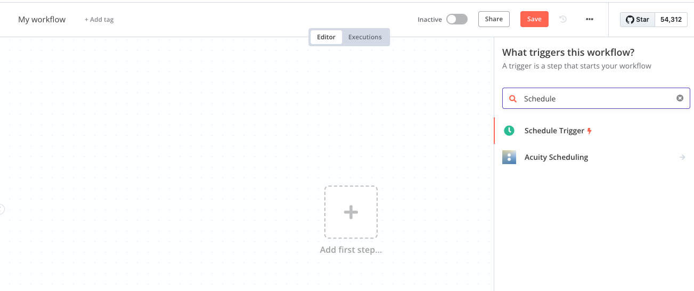
  <br/>
  3. Schedule Trigger을 선택하고, 캔바스에 노드를 추가한다. n8n은 노드를 오픈한다. 
  <br/>
  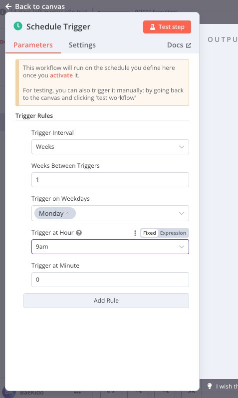
  <br/>
  1. Trigger 인터벌을 위해서 Weeks를 선택한다. 
  2. Weeks Between Triggers를 1로 설정한다. 
  3. 시간과 날짜를 입력한다. 
     1. 이 예제에서는 트리거 주에서 Monday를 선택한다. 
     2. 시간은 9am 을 선택하고, 분은 0을 입력한다. 
  4. 노드 상세를 닫고 캔바스로 돌아간다. 
  <br/>
  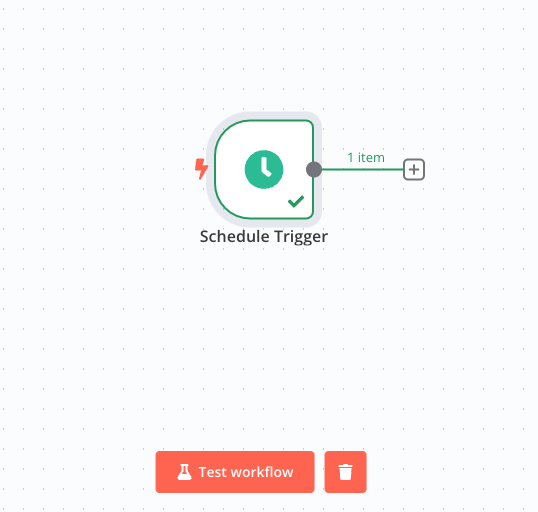
  <br/>

### Step 04. NASA 노드를 추가하고 credentials를 설정한다. 

- [NASA 노드](https://docs.n8n.io/integrations/builtin/app-nodes/n8n-nodes-base.nasa/)는 NASA [퍼블릭 APIs](https://api.nasa.gov/)와 인터렉션을 하도록 도와준다. 
- API를 통해 이번 튜토리얼에서 사용할 데이터를 얻을 수 있다. 
  1. 스케줄 트리거 노드에서 [+] 를 선택하여 Add node를 수행한다. 
  2. NASA를 검색하며, 매치되는 목록이 나열된다. 
    <br/>
    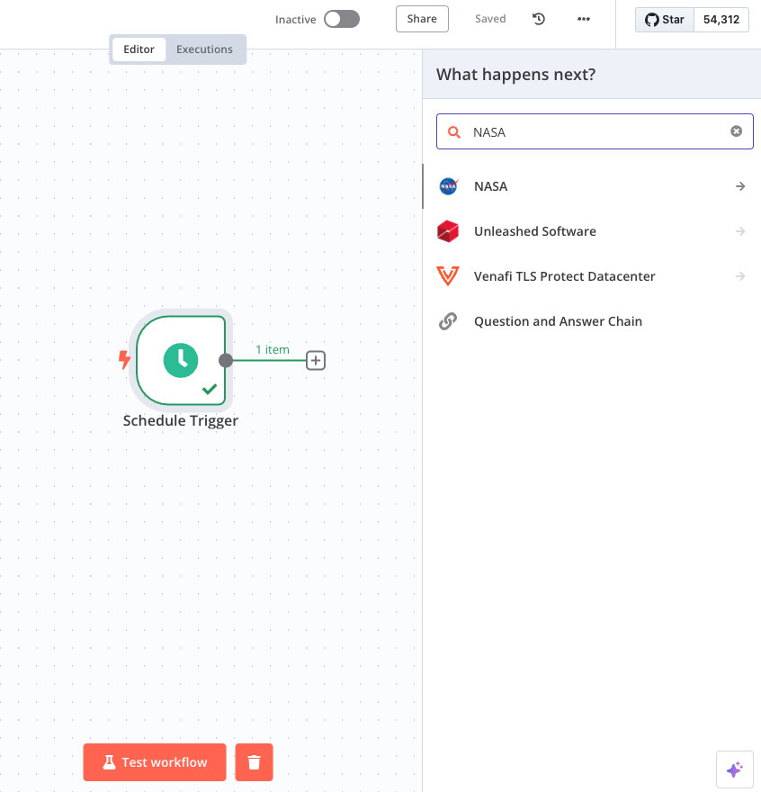
    <br/>
  3. NASA를 선택한다.
  4. 검색한후 DONKI solar flare 를 선택한다. 이 오퍼레이션은 최신 태양 플래어에 대한 리포트를 얻을 수 있다. 오퍼레이션을 선택하면 n8n은 노드를 캔바스에 추가하게 된다.
    <br/>
    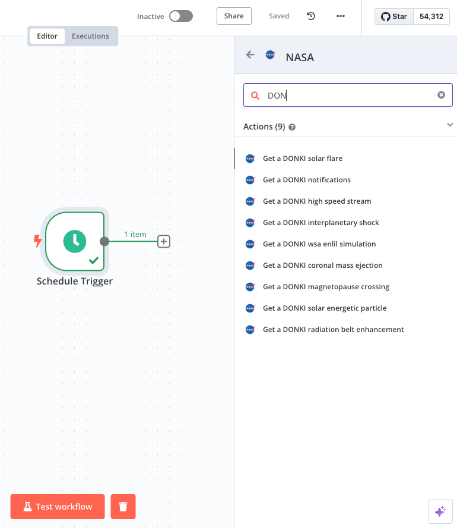
    <br/>
  5. NASA API에 접근하여, 크레덴셜을 설정해야한다.
     1. Credential for NASA API 드롭다운을 선택한다. 
    <br/>
    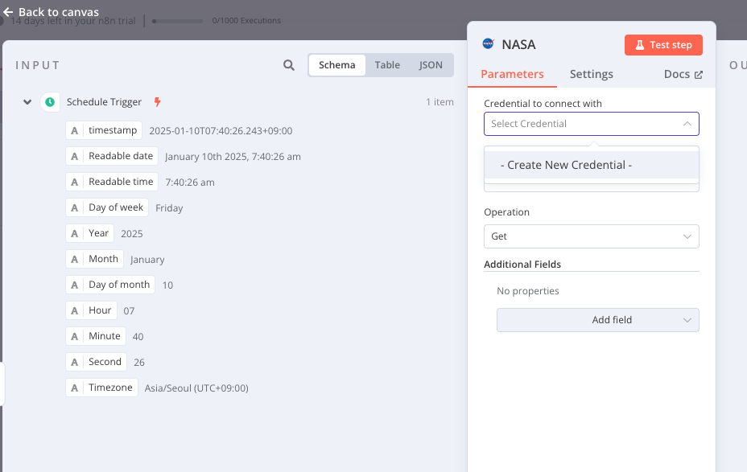
    <br/>
     2. Create New를 선택하여 credentials 뷰를 오픈한다.
     3. NASA APIs 에 가서 API 키를 생성하여 채워 넣는다. NASA는 키를 생성하고 보여줄 것이다.
    <br/>
    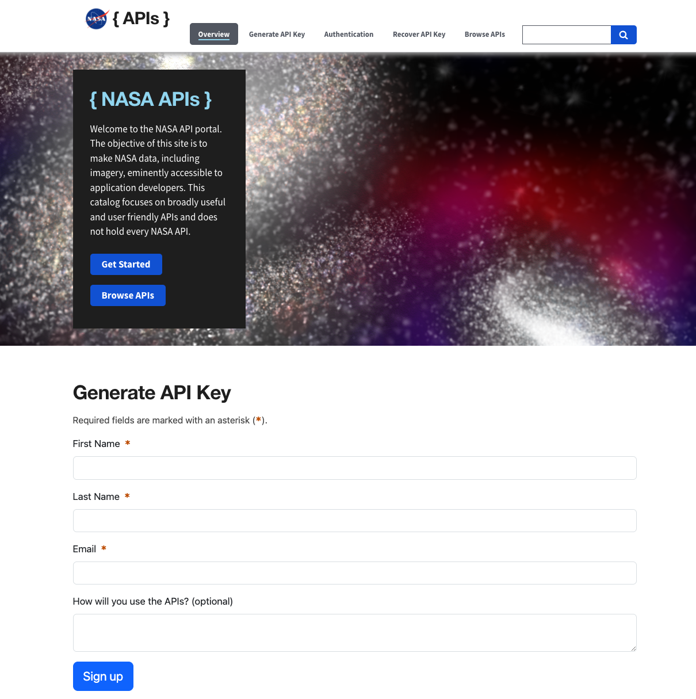
    <br/>
     4. 키를 복사하고, n8n에 API Key를 추가한다.
    <br/>
    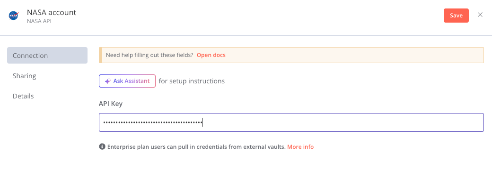
    <br/>
     5. Save를 선택한다. 
     6. credentials 스크린을 닫고, n8n 노드로 들어간다. 새로운 credentials 는 Credential for NASA API에 선택된 것을 자동 이용한다. 
    <br/>
    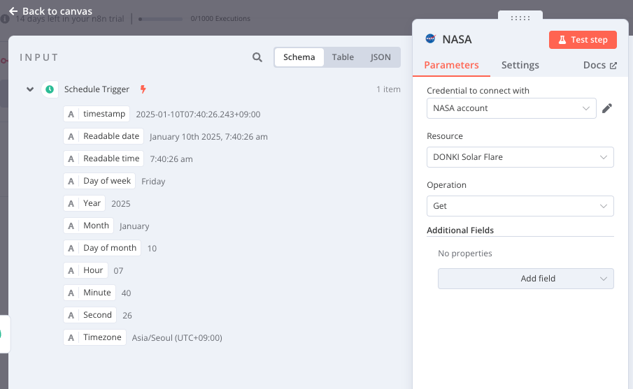
    <br/>
  6. 기본적으로 DONKY Solar Flare 는 지난 30일간의 데이터를 제공한다. 지난 주로 제한하기 위해서 Additional Fields를 이용한다. 
     1. Add field를 선택한다. 
     2. Start date를 선택한다.
    <br/>
    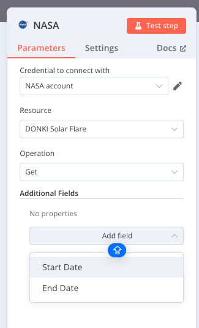
    <br/>
     3. 한주 전에서 부터 리포트를 얻기 위해서 표현식을 이용할 수 있다. Start date에세 Expression 탭을 선택하고, 확장 버튼을 연다.
    <br/>
    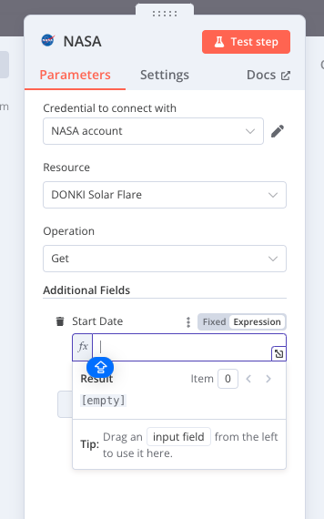
    <br/>
     4. Expression 필드에 다음 표현식을 추기한다. 
     ```json
      {{$today.minus({days: 7}).toFormat('yyyy-MM-dd')}}
     ```
     - 이렇게 하면 현재 날짜부터 이전 7일 데이터가 노출될 것이다. 
  7. Edit Expression 모달 창을 닫고 NASA노드로 돌아온다.
  8. Test Step 버튼을 클릭하여 정상 동작하는데 수동으로 노드를 체크할 수 있다. 
  n8n은 NASA API를 클릭하고, solar flares 데이터를 상세히 노출하고 OUTPUT 영역에 노출하게 된다. 
  
  <br/>
  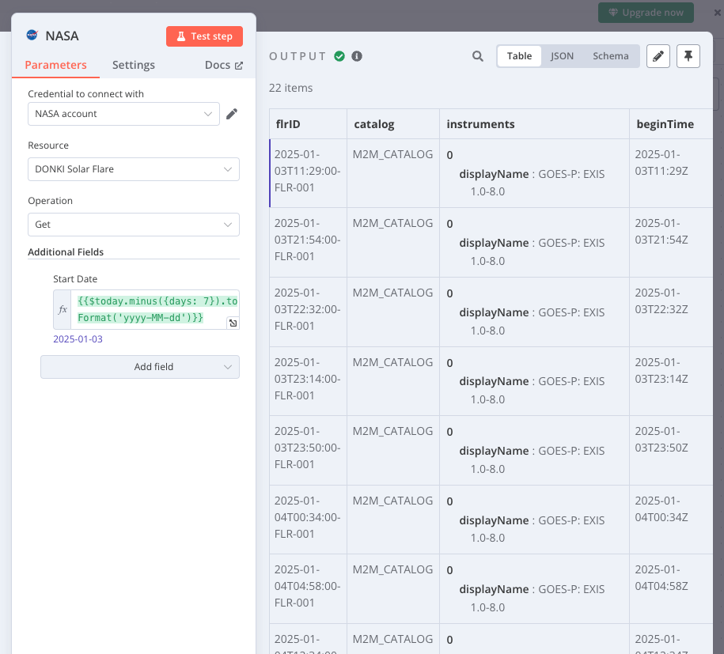
  <br/>
  9. NASA 노드를 닫고, 워크플로 캔바스로 돌아온다.
  <br/>
  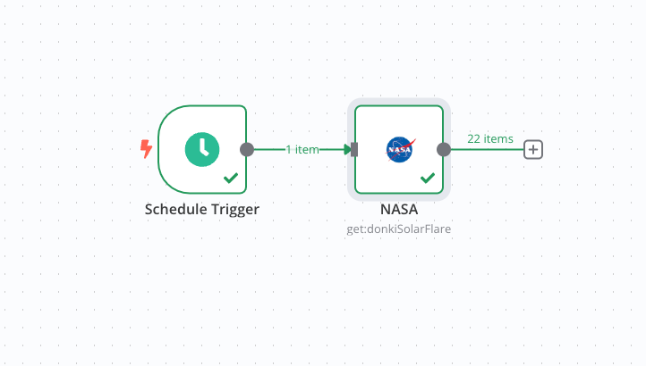
  <br/>

### Step 05. If node로 로직 추가하기

- n8n은 워크플로에 복잡한 로직을 제공한다. 
- 이번 예제에서 [If node](https://docs.n8n.io/integrations/builtin/core-nodes/n8n-nodes-base.if) 로 2개의 브렌치 노드를 생성하여, NASA데이터 리포트를 생성한다. 
- Solar flares 는 5가지 가능한 분류를 가진다. 
- 낮은 분류값, 높은분류값으로 나눠서 각각 리포트 노드에 전달한다. 
- If node를 추가
  1. Add node [+] 를 NASA노드에 연결한다. 
  2. If 를 검색하고, 검색 결과를 확인한다. 
  <br/>
  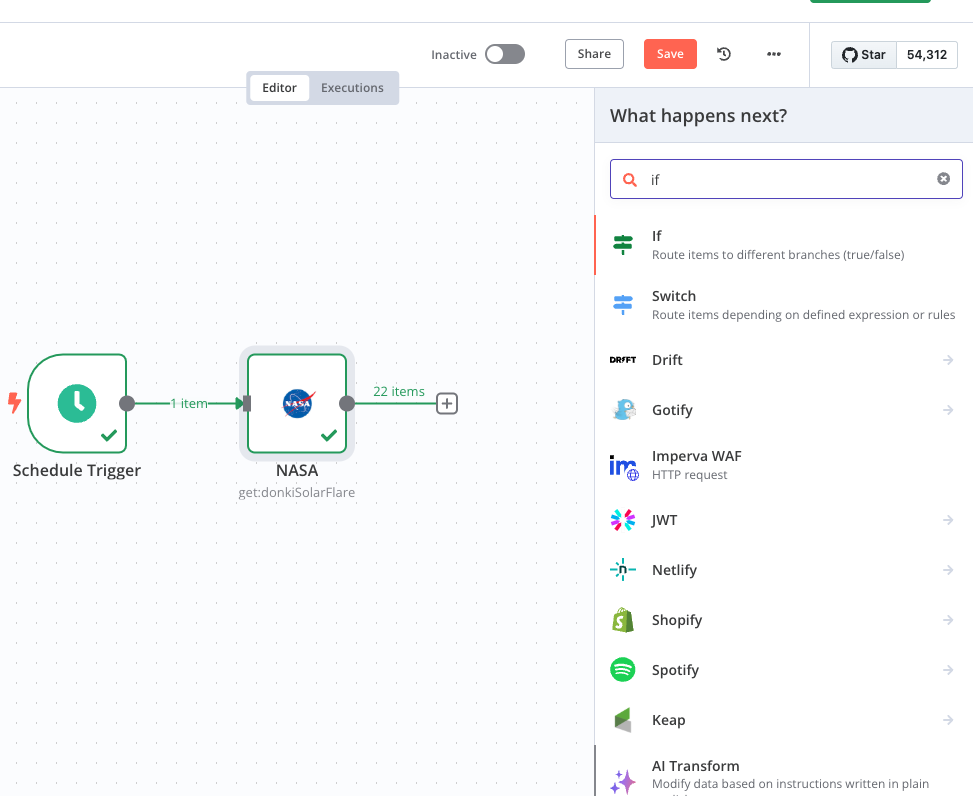
  <br/>
  3. If 를 선택하여 canvas에 노드를 추가한다. 
  4. NASA 데이터에서 classType 프로퍼티의 값을 체크해야한다. 
확인한다. 
  <br/>
  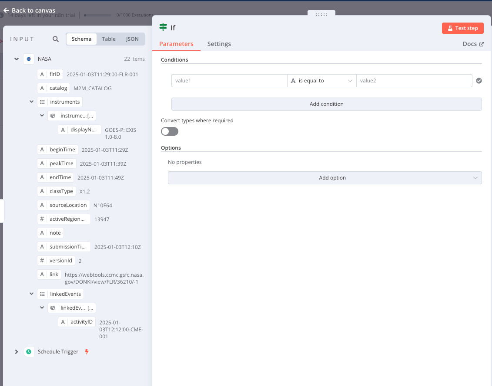
  <br/>
     1. classType를 값 1로 드래그한다. 
     2. String > Contains 비교 값을 수정한다. 
     3. Value 2 에 X를 추가한다. 이 값은 sloar flare의 높은 분류이다. 다음 스텝에서는 2개의 리포트를 생성할 것이다. X 클래스 solar flare와 다른 하나는 작은 solar flares 이다. 
     4. 이제 노드가 작동하고 예상 날짜를 반환하는지 확인할 수 있다. Test step 을 선택하여 노드를 수동으로 실행할 수 있다. OUTPUT 패널에 조건에 해당하는 결과가 true인지 false인지 확인할 수 있다. 확인한다. 
  <br/>
  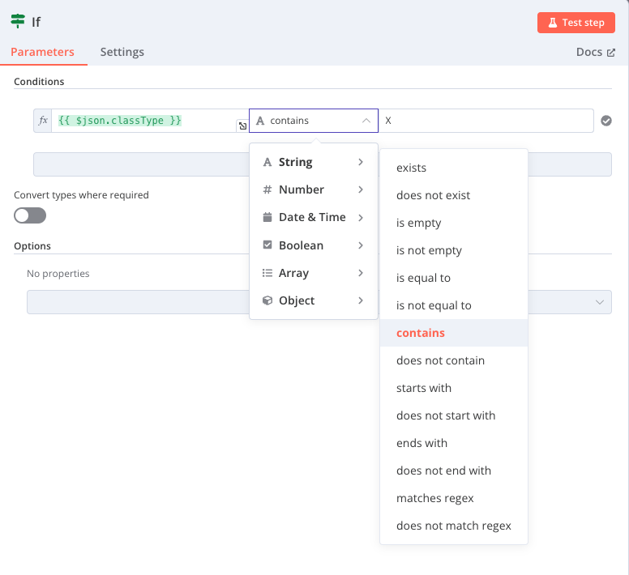
  <br/>

  5. 이벤트를 적용하였다면 이제 canvas로 돌아오자. 확인한다. 
  <br/>
  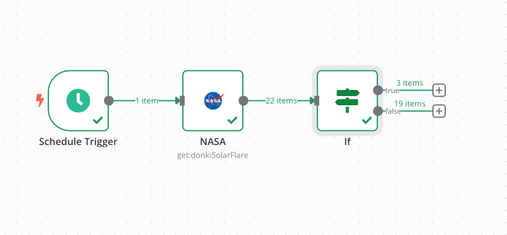
  <br/>

### Step 06. 워크플로우 에서 데이터를 출력한다. 

- 이제 마지막 스텝은 solar flares에 대해 2개의 리포트를 생성할 차례이다. 
- 이 예제에서는 [Postbin](https://www.toptal.com/developers/postbin/)으로 데이터를 보낸다. 
- Postbin은 데이터를 수신받고, 임시 웹 페이지에 노출하는 역할을 한다. 
  1. If node에서 Add node [+] 를 true에서 선택한다. 
  2. PostBin 을 검색하고 결과 목록을 살펴보자. 
  <br/>
  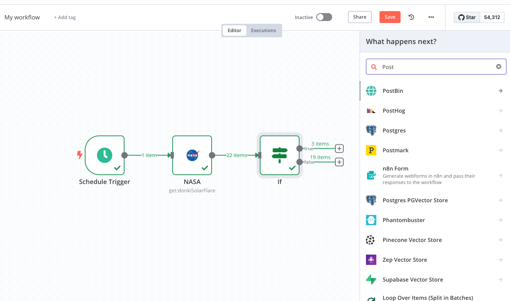
  <br/>
  3. PostBin 을 선택한다. 
  4. Send a request를 선택한다. n8n 은 노드를 캔바스에 추가하고 해당 정보를 연다.
  <br/>
  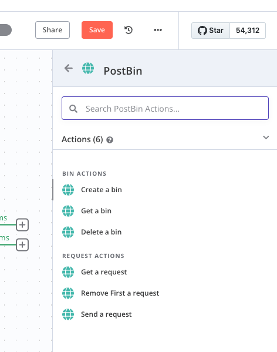
  <br/>
  5. [Postbin](https://www.toptal.com/developers/postbin/)으로 가서 Create Bin을 선택한다. 탭을 연 상태로 두고, 워크플로를 테스트할때 다시 돌아올 수 있도록 하자.
  <br/>
  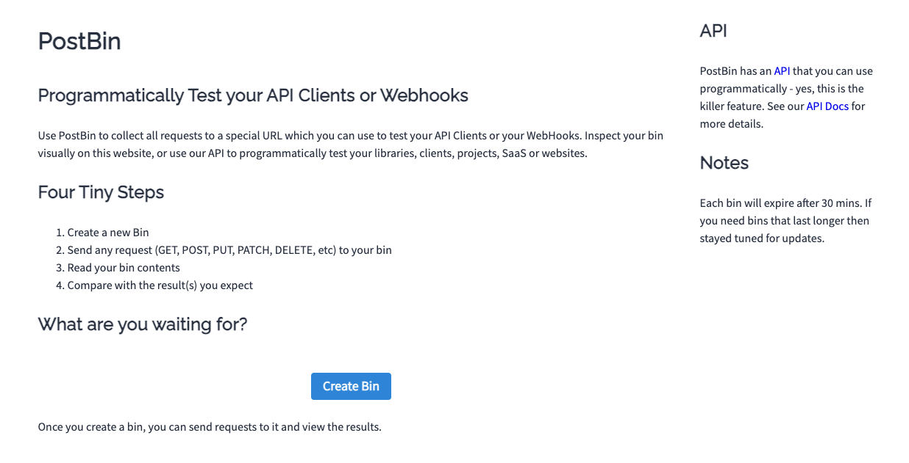
  <br/>
  참고: Postbin은 결과를 웹으로 볼수 있는 웹페이지를 생성하도록 해준다.
  6. bin ID를 복사한다. 
  <br/>
  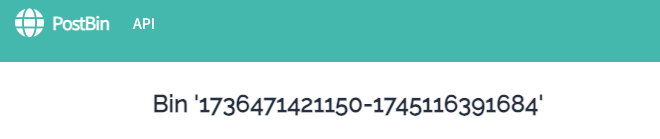
  <br/>
  이후 복사한 binID를 PostBin노드에 붙여 넣는다.
  <br/>
  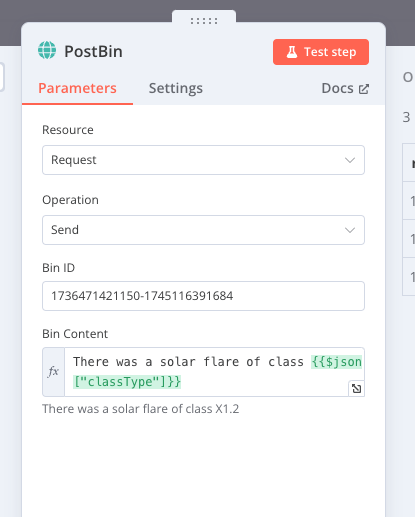
  <br/>
  7. 이제 데이터를 Postbin으로 전달하도록 설정한다. Bin Content로 가서 Expression 탭을 선택한다. 그리고 expression 에디터를 확장한다. 
  8. Current Node > Input Data > JSON > classType 을 선택한다. 
  9. 그리고 메시지를 다음과 깉이 추가한다. 
  ```
  There was a solar flare of class {{$json["classType"]}}
  ```
  10. expression 에디터를 닫는다. 
  11. Postbin노드를 닫고 캔바스로 돌아온다. 
  12. 다른 Postbin 노드를 추가하고, false를 출력 경로로 설정을 반복한다. 
  13. TestRun 으로 결과 확인하기
  <br/>
  
  <br/>

## 결론

- 워크플로를 이용하여 코드없이 NASA데이터를 읽고, 이 내용을 특정 조건에 맞게 검사하였다. 
- 이후 PostBin에 전달하여 화면에 내용을 출력해 보았다.
- n8n 퀵스타트를 통해서, 쉽고 빠르게 워크플로를 생성해 낼 수 있음을 알게 되었다. 